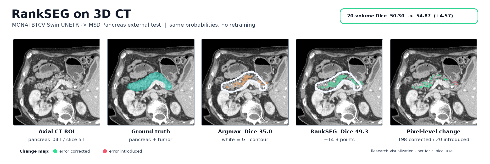
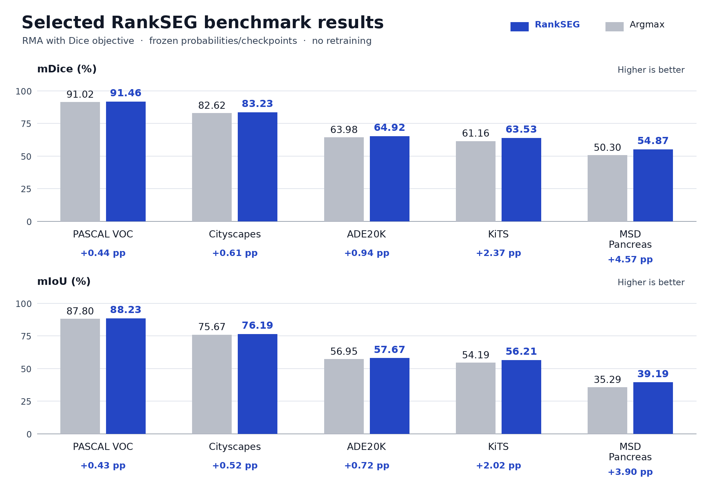

<div align="center">

# 🧩 RankSEG

#### Metric-Aware Dice/IoU Post-Processing Without Retraining

[](https://pypi.org/project/rankseg/)
[](https://opensource.org/licenses/BSD-3-Clause)
[](https://www.python.org)
[](https://pytorch.org)
[](https://github.com/rankseg/rankseg)
[](https://rankseg.readthedocs.io/en/latest/)
[](https://huggingface.co/spaces/statmlben/rankseg)
[](https://colab.research.google.com/drive/1c2znXP7_yt_9MrE75p-Ag82LHz-WfKq-?usp=sharing)
[](https://github.com/rankseg/rankseg/blob/main/README_zh.md)

[](https://www.jmlr.org/papers/v24/22-0712.html)
[](https://openreview.net/pdf?id=4tRMm1JJhw)


[**News**](#-news) | [**Quick Start**](#-quick-start) | [**Benchmarks**](#-benchmarks) | [**Integrations**](#-integrations) | [**Docs**](https://rankseg.readthedocs.io/en/latest/) | [**Citation**](#-citation)
</div>

---

**RankSEG** replaces `argmax` or fixed thresholds with metric-aware post-processing
designed to improve Dice or IoU—**no retraining or fine-tuning**.
Use it with frozen PyTorch segmentation models for multiclass, binary, and
multilabel tasks, from natural images to 3D medical scans.

<div align="center">
  <p><b>RankSEG on 3D CT</b> · Same model. No retraining.</p>
  <picture>
    <source media="(prefers-color-scheme: dark)" srcset="./fig/monai_pancreas_rankseg_dark.png">
    <source media="(prefers-color-scheme: light)" srcset="./fig/monai_pancreas_rankseg.png">
    
  </picture>
  <p><b>20-volume mean Dice: 50.30 → 54.87 (+4.57 pp)</b><br>
  Frozen MONAI BTCV Swin UNETR · MSD Pancreas.</p>
  <p>Illustrative slice above; white outline = ground truth. Research use only.<br>
  <a href="https://github.com/rankseg/rankseg-benchmark#monai-datasets-and-checkpoints">Evaluation protocol and example selection</a>.</p>
</div>

## 📰 News

- **August 2026 — RankSEG joins the official MONAI Tutorials!** Try metric-aware post-processing for 3D medical segmentation. [Tutorial](https://github.com/Project-MONAI/tutorials/blob/main/modules/rankseg_integration.ipynb) · [Colab](https://colab.research.google.com/github/Project-MONAI/tutorials/blob/main/modules/rankseg_integration.ipynb)

## ⚡ Quick Start

```bash
pip install -U rankseg
```

Optional Linux x86-64 GPU acceleration: `pip install "rankseg[cuda]"`
([setup and activation](https://rankseg.readthedocs.io/en/latest/getting_started.html#optional-cuda-acceleration)).

For multiclass model logits shaped `(batch, classes, *spatial)`, with at least two classes:

```python
from rankseg import RankSEG

probs = model_logits.softmax(dim=1)
preds = RankSEG(metric="dice")(probs)  # replaces argmax; shape: (batch, *spatial)
```

For binary/multilabel examples, the functional API, and solver options, see the
[Getting Started guide](https://rankseg.readthedocs.io/en/latest/getting_started.html).

RMA Dice offers optional memory-saving screening with `safe_screening="auto"`.
The default remains `False`, preserving the original computation path. Opting in
may change masks near numerical ties. [Details](https://rankseg.readthedocs.io/en/latest/API.html#experimental-rma-safe-screening).

**Try it online:** [Colab](https://colab.research.google.com/drive/1c2znXP7_yt_9MrE75p-Ag82LHz-WfKq-?usp=sharing) · [Interactive demo](https://huggingface.co/spaces/statmlben/rankseg)

## 📊 Benchmarks

**Same probabilities. No retraining.** Selected results compare `argmax` with
RankSEG-RMA using the Dice objective. Scores are percentages; gains are
percentage points (pp).

<div align="center">
  <picture>
    <source media="(prefers-color-scheme: dark)" srcset="./fig/benchmark_results_dark.png">
    <source media="(prefers-color-scheme: light)" srcset="./fig/benchmark_results.png">
    
  </picture>
</div>

Gains vary by dataset. Full results, metric definitions, runtime, and
reproduction commands: [rankseg-benchmark](https://github.com/rankseg/rankseg-benchmark).
For the algorithm and additional experiments, see our [NeurIPS 2025 paper](https://openreview.net/forum?id=4tRMm1JJhw).

## 🔌 Integrations

Choose your workflow:

| Ecosystem | Get started | Try online |
| :--- | :--- | :--- |
| **PyTorch** | [Docs](https://rankseg.readthedocs.io/en/latest/integrations_pytorch.html) · [Example](./examples/pytorch_native_rankseg.py) | [Colab](https://colab.research.google.com/drive/1c2znXP7_yt_9MrE75p-Ag82LHz-WfKq-?usp=sharing) |
| **Hugging Face** | [Docs](https://rankseg.readthedocs.io/en/latest/integrations_transformers.html) · [Notebook](./notebooks/rankseg_with_transformers.ipynb) | [Colab](https://colab.research.google.com/github/rankseg/rankseg/blob/main/notebooks/rankseg_with_transformers.ipynb) |
| **SAM family** | [Docs](https://rankseg.readthedocs.io/en/latest/integrations_sam.html) · [Notebook](./notebooks/rankseg_with_sam_family.ipynb) | [Colab](https://colab.research.google.com/github/rankseg/rankseg/blob/main/notebooks/rankseg_with_sam_family.ipynb) |
| **MONAI** | [Docs](https://rankseg.readthedocs.io/en/latest/integrations_monai.html) · [Official tutorial](https://github.com/Project-MONAI/tutorials/blob/main/modules/rankseg_integration.ipynb) | [Colab](https://colab.research.google.com/github/Project-MONAI/tutorials/blob/main/modules/rankseg_integration.ipynb) |
| **PaddleSeg** (externally maintained) | [Docs](https://rankseg.readthedocs.io/en/latest/integrations_paddleseg.html) · [Community branch](https://github.com/Leev1s/rankseg/tree/paddleseg/rankseg/paddleseg) | — |

## 🔗 Citation

If you use RankSEG in your research, please cite our papers:

> - Dai, B., & Li, C. (2023). RankSEG: A Consistent Ranking-based Framework for Segmentation. *Journal of Machine Learning Research*, **24**(224), 1-50. [[link]](https://www.jmlr.org/papers/v24/22-0712.html)
> - Wang, Z., & Dai, B. (2025). RankSEG-RMA: An Efficient Segmentation Algorithm via Reciprocal Moment Approximation. *Advances in Neural Information Processing Systems (NeurIPS 2025)*. [[link]](https://openreview.net/pdf?id=4tRMm1JJhw)


```bibtex
@article{dai2023rankseg,
  title={RankSEG: A Consistent Ranking-based Framework for Segmentation},
  author={Dai, Ben and Li, Chunlin},
  journal={Journal of Machine Learning Research},
  volume={24},
  number={224},
  pages={1--50},
  url={https://www.jmlr.org/papers/v24/22-0712.html},
  year={2023}
}

@inproceedings{wang2025rankseg,
  title={RankSEG-RMA: An Efficient Segmentation Algorithm via Reciprocal Moment Approximation},
  author={Wang, Zixun and Dai, Ben},
  booktitle={Advances in Neural Information Processing Systems},
  url={https://arxiv.org/abs/2510.15362},
  year={2025}
}
```

---

<div align="center">
  <p>Star us on GitHub if RankSEG helps your project! ⭐</p>
</div>
