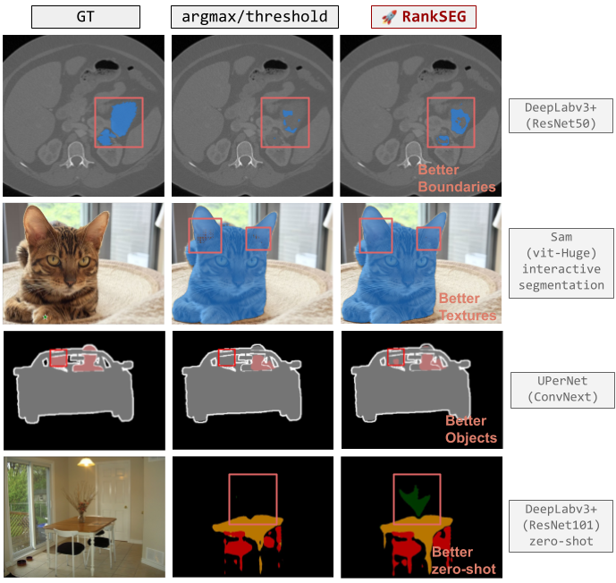

<div align="center">

# 🧩 RankSEG: 无需重新训练即可瞬间提升分割模型的 Dice/IoU 指标

[](https://pypi.org/project/rankseg/)
[](https://opensource.org/licenses/BSD-3-Clause)
[](https://www.python.org)
[](https://pytorch.org)
[](https://github.com/rankseg/rankseg)
[](https://rankseg.readthedocs.io/en/latest/)

[](https://huggingface.co/spaces/statmlben/rankseg)
[](https://colab.research.google.com/drive/1c2znXP7_yt_9MrE75p-Ag82LHz-WfKq-?usp=sharing)

[](https://www.jmlr.org/papers/v24/22-0712.html)
[](https://openreview.net/pdf?id=4tRMm1JJhw)
[](./README.md)

</div>

**RankSEG** 是一个**即插即用**的后处理模块，可在推理过程中改善分割结果。它适用于**任何预训练的概率输出分割模型**（SAM, DeepLab, SegFormer, UPerNet 等），无需任何重新训练或微调。

不像使用简单的`阈值化`或`argmax`（这些方法不关心 Dice/IoU 分数），RankSEG 直接针对这些指标进行优化，从而为您提供更好的结果，而无需任何额外的训练。

了解 RankSEG 的更多信息，请查看[我们的文档](https://rankseg.readthedocs.io/en/latest/)。

<!---->

<div align="center">
  
</div>

---

## ⚡ 快速开始

几秒钟内即可上手。RankSEG 旨在直接嵌入您现有的推理流程中。

### 1. 安装

```bash
pip install -U rankseg
```

### 2. 优化预测

只需在您的推理循环中添加 3 行代码：

```python
import torch
import torch.nn.functional as F
from rankseg import RankSEG

# 1. 初始化 RankSEG (针对 Dice 分数进行优化)
rankseg = RankSEG(metric='dice', solver='RMA')

# 2. 获取模型的概率输出 (Batch, Class, Height, Width)
# 示例: probs = model(images).softmax(dim=1)
probs = F.softmax(torch.randn(4, 21, 256, 256), dim=1)

# 3. 获取优化后的预测结果 (无需重新训练！)
preds = rankseg.predict(probs)
```

> 💡 **立即尝试:**
> [](https://colab.research.google.com/drive/1c2znXP7_yt_9MrE75p-Ag82LHz-WfKq-?usp=sharing)

---

## ✨ 主要特性

- **🚀 指标瞬间提升**：相比标准的 `argmax`，持续提升 mIoU 和 mDice 分数。
- **🔌 即插即用**：兼容**任何** PyTorch 分割模型。
- **🆓 无需训练**：纯后处理。无需梯度、无需反向传播、无需数据集。
- **⚡ 高效**：优化的求解器 (RMA) 适用于实时推理。
- **🧩 灵活**：支持多类和多标签分割任务。

---

## 📊 为什么选择 RankSEG?

标准的分割方法使用 `argmax` 或阈值，这些方法并没有针对 Dice 或 IoU 等评估指标进行**优化**。RankSEG 通过在推理过程中直接优化目标指标来解决这个问题。

**性能对比 (无重新训练):**

| 模型 | 数据集 | mIoU (Argmax) | mIoU (RankSEG) | mDice (Argmax) | mDice (RankSEG) |
|-------|---------|---------------|----------------|----------------|-----------------|
| DeepLabV3+ (ResNet101) | PASCAL VOC | 77.25% | **78.14%** ↑0.89% | 82.08% | **83.14%** ↑1.06% |
| SegFormer (MiT-B4) | PASCAL VOC | 77.57% | **78.59%** ↑1.02% | 82.15% | **83.22%** ↑1.07% |
| UPerNet (ConvNeXt) | PASCAL VOC | 79.52% | **80.31%** ↑0.79% | 84.11% | **84.98%** ↑0.87% |
| PSPNet (ResNet101) | Cityscapes | 65.89% | **66.53%** ↑0.64% | 73.55% | **74.28%** ↑0.73% |
| DeepLabV3+ (ResNet101) | Cityscapes | 66.17% | **66.68%** ↑0.51% | 73.71% | **74.33%** ↑0.62% |
| UPerNet (ConvNeXt) | Cityscapes | 68.83% | **69.57%** ↑0.74% | 76.08% | **76.97%** ↑0.89% |
| SegFormer (MiT-B4) | ADE20K | 40.00% | **40.82%** ↑0.82% | 46.50% | **47.57%** ↑1.07% |
| UPerNet (ConvNeXt) | ADE20K | 42.86% | **43.84%** ↑0.98% | 49.61% | **50.85%** ↑1.24% |
| CPT (Swin-Large) | ADE20K | 44.59% | **45.56%** ↑0.97% | 51.27% | **52.58%** ↑1.31% |

*结果来自我们的 [NeurIPS 2025 论文](https://openreview.net/forum?id=4tRMm1JJhw)。*

---

## 🛠️ 集成

RankSEG 开箱即用，支持任何基于 PyTorch 的分割框架。

| 框架 | 任务 | 集成指南 |
| :--- | :--- | :--- |
| **PyTorch (Native)** | 语义分割 | [](https://colab.research.google.com/drive/1c2znXP7_yt_9MrE75p-Ag82LHz-WfKq-?usp=sharing) |
| **SegmentAnything** | 语义分割 | [](https://colab.research.google.com/drive/1Gj-rG3ZnFN5OYTcgdJHfUuiSJtWVpgfu?usp=sharing) |
| **MMSegmentation** | 语义分割 | *即将推出* |
| **PaddleSeg** | 语义分割 | *即将推出* |

> **注意**：没看到您喜欢的框架？提交一个 [issue](https://github.com/rankseg/rankseg/issues) 或提交 PR！

---

## 📚 文档与资源

- **完整文档**: [rankseg.readthedocs.io](https://rankseg.readthedocs.io/en/latest/)
- **JMLR 论文**: [RankSEG: A Consistent Ranking-based Framework for Segmentation](https://www.jmlr.org/papers/v24/22-0712.html)
- **NeurIPS 论文**: [RankSEG-RMA: An Efficient Segmentation Algorithm via Reciprocal Moment Approximation](https://openreview.net/pdf?id=4tRMm1JJhw)

## 🔗 引用

如果您在研究中使用了 RankSEG，请引用我们的论文：

```bibtex
@article{dai2023rankseg,
  title={RankSEG: A Consistent Ranking-based Framework for Segmentation},
  author={Dai, Ben and Li, Chunlin},
  journal={Journal of Machine Learning Research},
  volume={24},
  number={224},
  pages={1--50},
  year={2023}
}

@inproceedings{wang2025rankseg,
  title={RankSEG-RMA: An Efficient Segmentation Algorithm via Reciprocal Moment Approximation},
  author={Wang, Zixun and Dai, Ben},
  booktitle={Advances in Neural Information Processing Systems},
  year={2025}
}
```

## 🤝 贡献

我们欢迎贡献！请随时在我们的 [GitHub 仓库](https://github.com/rankseg/rankseg)上提交 issue 或 pull request。

<div align="center">
  <br>
  <p>如果您觉得 RankSEG 有用，请给我们一颗星！ ⭐</p>
</div>
