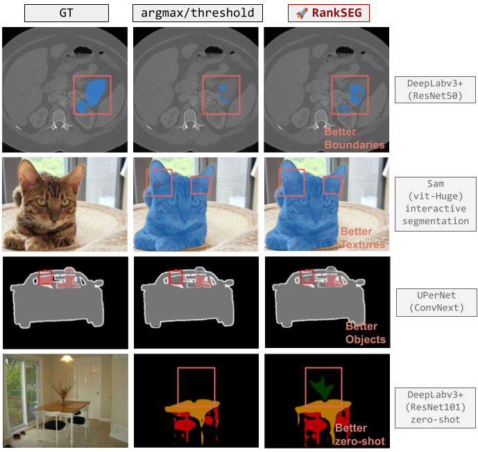

<div align="center">

# 🧩 RankSEG：无需重新训练的 Dice/IoU 指标感知后处理

[](https://pypi.org/project/rankseg/)
[](https://opensource.org/licenses/BSD-3-Clause)
[](https://www.python.org)
[](https://pytorch.org)
[](https://github.com/rankseg/rankseg)
[](https://rankseg.readthedocs.io/en/latest/)

[](https://huggingface.co/spaces/statmlben/rankseg)
[](https://colab.research.google.com/drive/1c2znXP7_yt_9MrE75p-Ag82LHz-WfKq-?usp=sharing)

[](https://www.jmlr.org/papers/v24/22-0712.html)
[](https://openreview.net/pdf?id=4tRMm1JJhw)
[](https://github.com/rankseg/rankseg/blob/main/README.md)

[**新闻**](#-新闻) | [**快速开始**](#-快速开始) | [**官方集成路径**](#-官方集成路径) | [**主要特性**](#-主要特性) | [**Benchmarks**](#-benchmarks) | [**引用**](#-引用)

</div>

---

## 📰 新闻

- **2026 年 8 月——RankSEG 已正式收录于 MONAI 官方 Tutorials！** 教程展示了如何将 RankSEG 和 RankSEGd 作为可选的第三方后处理 transform 接入 MONAI，并在预训练的 3D 胰腺分割模型上与 argmax 进行比较。[查看教程](https://github.com/Project-MONAI/tutorials/blob/main/modules/rankseg_integration.ipynb) · [在 Colab 中运行](https://colab.research.google.com/github/Project-MONAI/tutorials/blob/main/modules/rankseg_integration.ipynb)

**RankSEG** 是一个**即插即用**的后处理模块，旨在推理阶段改善 samplewise Dice/IoU。它适用于多种预训练的概率输出分割模型（SAM、DeepLab、SegFormer、UPerNet 等），无需重新训练或微调。

简单的`阈值化`或`argmax`不会直接优化 Dice/IoU。RankSEG 使用指标感知的排序方法在推理阶段针对所选指标进行决策。实际增益取决于概率质量和部署数据分布，应在有代表性的数据上进行验证。

了解 RankSEG 的更多信息，请查看[我们的文档](https://rankseg.readthedocs.io/en/latest/)。

> 如果 RankSEG 对您的分割工作流有帮助，欢迎给项目点一个 star：
> https://github.com/rankseg/rankseg

<!---->

<div align="center">
  
</div>

## 🌟 为什么选择 RankSEG?

传统分割通常使用 `argmax` 或固定阈值，但这些方法并没有直接针对 Dice / IoU 等非可分解指标进行优化。RankSEG 在推理阶段使用指标感知的排序方法，能够在不重训模型的情况下改善部分任务的表现。

## ⚡ 快速开始

RankSEG 可以直接插入现有的 PyTorch 分割推理流程中。

### 1. 安装

```bash
pip install -U rankseg
```

### 2. 基本用法


```python
from rankseg import RankSEG
import torch.nn.functional as F

# 1. 使用官方默认配置初始化 RankSEG
rankseg = RankSEG(metric="dice", solver="RMA", output_mode="multiclass")

# 2. 获取模型的概率输出
# probs: (batch_size, num_classes, *image_shape)
probs = F.softmax(model_logits, dim=1)

# 3. 获取优化后的预测结果
preds = rankseg(probs)
```

你也可以使用 functional API 进行一次性预测：

```python
from rankseg.functional import rankseg

preds = rankseg(probs, metric="dice", solver="RMA", output_mode="multiclass")
```

RankSEG 会严格检查 metric、output mode 与 solver 的兼容性；不支持的组合会直接报错，
而不会静默切换到其他算法。具体组合请参阅
[solver 选择指南](https://rankseg.readthedocs.io/en/latest/getting_started.html#solver-selection)。
多标签预测始终使用 `torch.bool`，形状为
`(batch_size, num_classes, *image_shape)`；多类预测始终使用 `torch.int64`，
形状为 `(batch_size, *image_shape)`。

> 💡 **立即尝试:**
> [](https://colab.research.google.com/drive/1c2znXP7_yt_9MrE75p-Ag82LHz-WfKq-?usp=sharing)
>
> 官方 PyTorch 集成路径：
> [Docs](https://rankseg.readthedocs.io/en/latest/integrations_pytorch.html) · [Example](./examples/pytorch_native_rankseg.py)
>
> Hugging Face 语义分割集成路径：
> [Notebook](./notebooks/rankseg_with_transformers.ipynb) · [Colab](https://colab.research.google.com/github/rankseg/rankseg/blob/main/notebooks/rankseg_with_transformers.ipynb)
>
> SAM 系列集成路径：
> [Notebook](./notebooks/rankseg_with_sam_family.ipynb) · [Colab](https://colab.research.google.com/github/rankseg/rankseg/blob/main/notebooks/rankseg_with_sam_family.ipynb)
>
> MONAI 官方教程：
> [Notebook](https://github.com/Project-MONAI/tutorials/blob/main/modules/rankseg_integration.ipynb) · [Colab](https://colab.research.google.com/github/Project-MONAI/tutorials/blob/main/modules/rankseg_integration.ipynb)

## 🔌 官方集成路径

以下包括本仓库维护的 RankSEG 集成入口和官方生态教程。

| 路径 | 状态 | 入口 |
| :--- | :---: | :--- |
| **PyTorch Native** | **Ready** | [Docs](https://rankseg.readthedocs.io/en/latest/integrations_pytorch.html) · [Example](./examples/pytorch_native_rankseg.py) |
| **Hugging Face 语义分割** | **Ready** | `from rankseg.integration import transformers` -> `transformers.postprocess` / `transformers.restore_semantic_probs` · [Docs](https://rankseg.readthedocs.io/en/latest/integrations_transformers.html) · [Example](./examples/transformers_rankseg.py) |
| **SAM 系列** | **Ready** | `from rankseg.integration import sam` -> `sam.Sam1` / `sam.Sam2` / `sam.Sam3` · [Docs](https://rankseg.readthedocs.io/en/latest/integrations_sam.html) · [Notebook](./notebooks/rankseg_with_sam_family.ipynb) |
| **MONAI** | **官方教程** | 可选的第三方 `RankSEG` / `RankSEGd` transform · [Docs](https://rankseg.readthedocs.io/en/latest/integrations_monai.html) · [MONAI Tutorial](https://github.com/Project-MONAI/tutorials/blob/main/modules/rankseg_integration.ipynb) · [Colab](https://colab.research.google.com/github/Project-MONAI/tutorials/blob/main/modules/rankseg_integration.ipynb) |

## 🌐 外部集成路径

以下集成已经存在，但当前主要由主仓库之外的实现维护。

| 集成 | 状态 | 入口 |
| :--- | :---: | :--- |
| **PaddleSeg** | External | [Docs](https://rankseg.readthedocs.io/en/latest/integrations_paddleseg.html) · [Branch](https://github.com/Leev1s/rankseg/tree/paddleseg/rankseg/paddleseg) · [Docker](https://ghcr.io/leev1s/rankseg) |

## ✨ 主要特性

- **🚀 已验证的指标增益**：在论文报告的 benchmarks 中，相比标准 `argmax` 改善了 mIoU 和 mDice。
- **🔌 即插即用**：兼容输出概率图的 PyTorch 分割模型。无需重训。
- **🆓 无需训练**：纯后处理。无需梯度、无需反向传播、无需数据集。
- **⚡ 高效默认路径**：推荐使用 `RMA` 作为默认推理求解器。
- **🧩 灵活**：支持多类和多标签分割任务。

## 📊 Benchmarks

以下精选结果在五个分割数据集上，使用相同的冻结概率或 checkpoint 比较
`argmax` 与 RankSEG-RMA。柱高表示指标分数（%），柱顶标注具体数值，
数据集下方标注提升的百分点。

<div align="center">
  <picture>
    <source media="(prefers-color-scheme: dark)" srcset="./fig/benchmark_results_dark.png">
    <source media="(prefers-color-scheme: light)" srcset="./fig/benchmark_results.png">
    
  </picture>
</div>

医学结果使用冻结的 BTCV Swin UNETR checkpoint，在固定的 MSD Pancreas
外部测试 cohort 上评估；根据公开的数据集 provenance，这些病例未参与
训练、checkpoint 选择或后处理参数选择。包含独立 MSD Spleen 评测在内的
完整结果、协议、decoder 延迟、manifest 和复现命令见
[rankseg-benchmark](https://github.com/rankseg/rankseg-benchmark)。

*算法细节及更多实验见我们的 [NeurIPS 2025 论文](https://openreview.net/forum?id=4tRMm1JJhw)。*

## 🧪 更多演示

以下内容作为额外演示和扩展生态入口保留：

| 框架 | 任务 | 快速入口 |
| :--- | :--- | :--- |
| **MONAI** | 3D 医学分割集成 | [](https://colab.research.google.com/github/Project-MONAI/tutorials/blob/main/modules/rankseg_integration.ipynb) |
| **SAM 系列** | SAM1、SAM2、SAM3 分割 | [](https://colab.research.google.com/github/rankseg/rankseg/blob/main/notebooks/rankseg_with_sam_family.ipynb) |
| **Hugging Face** | 互动演示 | [](https://huggingface.co/spaces/statmlben/rankseg) |

## 🔗 引用

如果您在研究中使用了 RankSEG，请引用我们的论文：

- Dai, B., & Li, C. (2023). RankSEG: A Consistent Ranking-based Framework for Segmentation. *Journal of Machine Learning Research*, **24**(224), 1-50. [[link]](https://www.jmlr.org/papers/v24/22-0712.html)
- Wang, Z., & Dai, B. (2025). RankSEG-RMA: An Efficient Segmentation Algorithm via Reciprocal Moment Approximation. *Advances in Neural Information Processing Systems (NeurIPS 2025)*. [[link]](https://openreview.net/pdf?id=4tRMm1JJhw)


```bibtex
@article{dai2023rankseg,
  title={RankSEG: A Consistent Ranking-based Framework for Segmentation},
  author={Dai, Ben and Li, Chunlin},
  journal={Journal of Machine Learning Research},
  volume={24},
  number={224},
  pages={1--50},
  url={https://www.jmlr.org/papers/v24/22-0712.html},
  year={2023}
}

@inproceedings{wang2025rankseg,
  title={RankSEG-RMA: An Efficient Segmentation Algorithm via Reciprocal Moment Approximation},
  author={Wang, Zixun and Dai, Ben},
  booktitle={Advances in Neural Information Processing Systems},
  url={https://arxiv.org/abs/2510.15362},
  year={2025}
}
```

## 🤝 贡献

我们欢迎贡献！请随时在我们的 [GitHub 仓库](https://github.com/rankseg/rankseg)上提交 issue 或 pull request。

<div align="center">
  <br>
  <p>如果您觉得 RankSEG 有用，请给我们一颗星！ ⭐</p>
</div>
